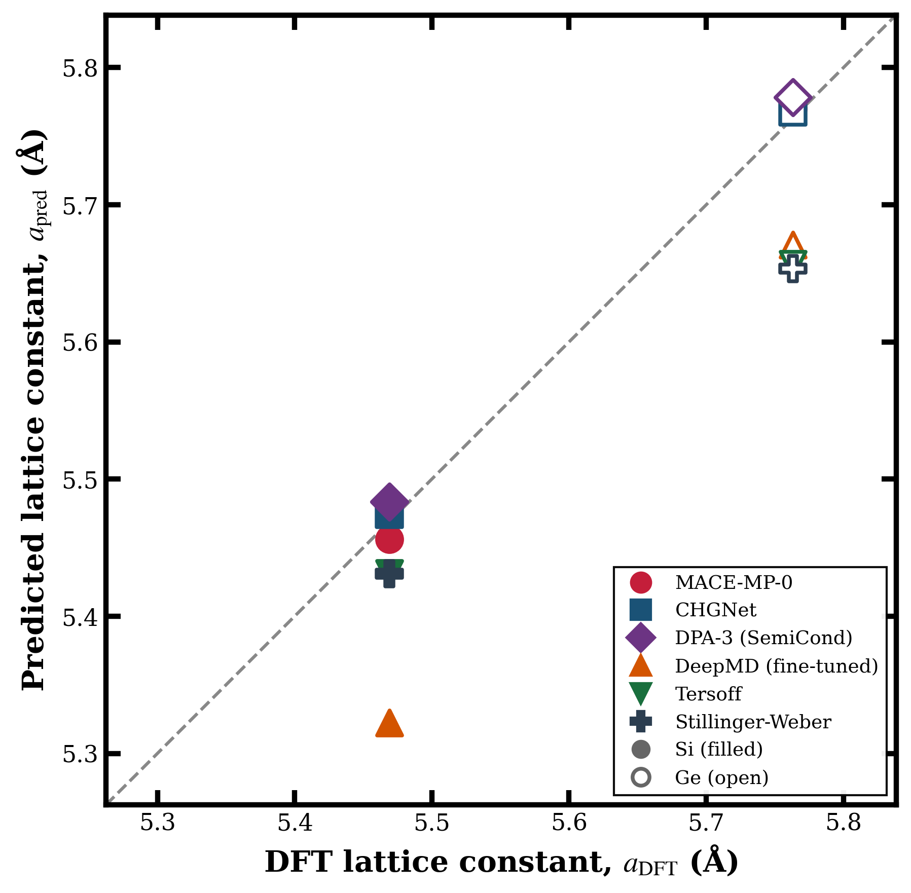
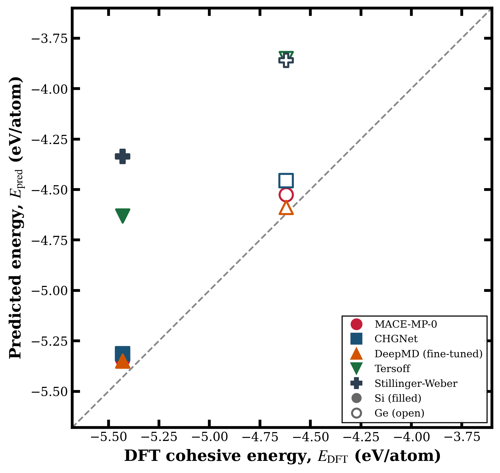
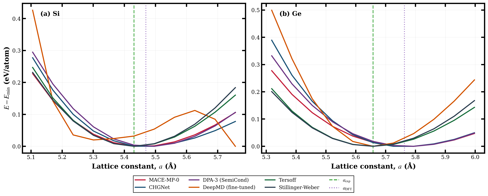
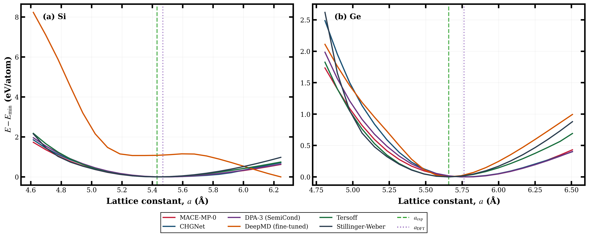
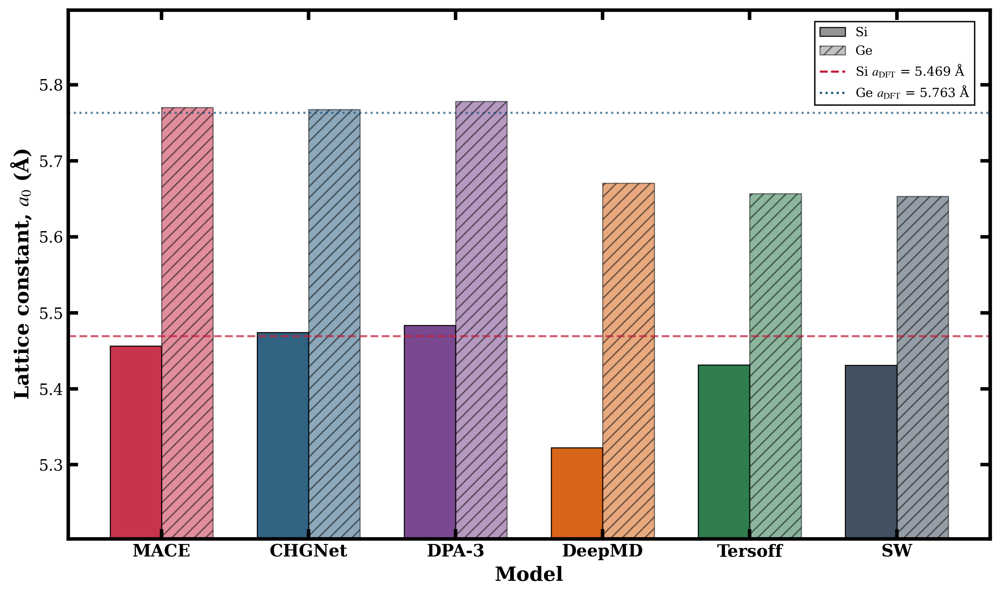
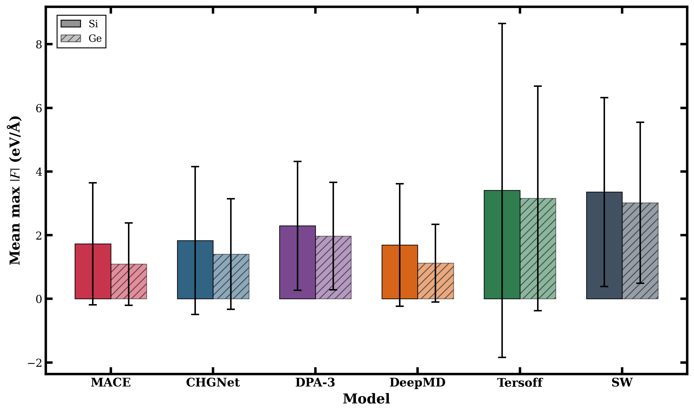
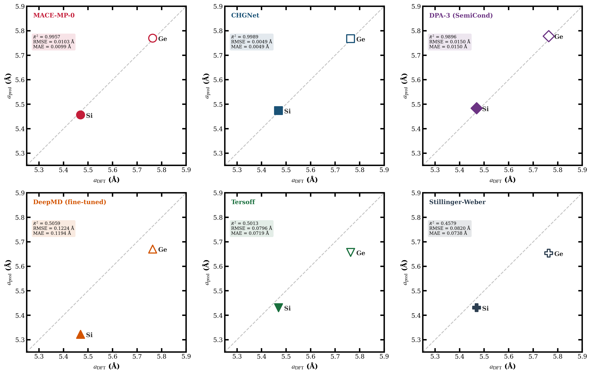
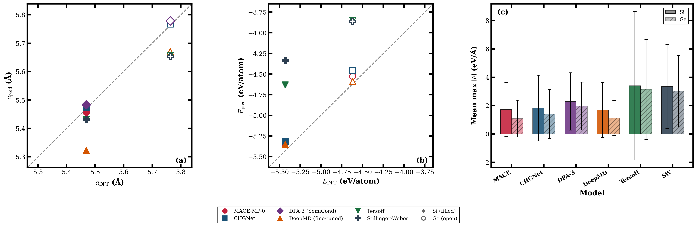
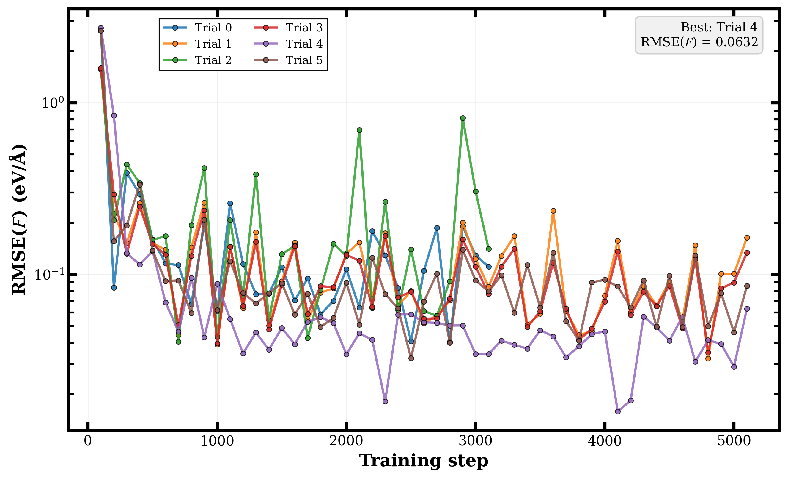

<div align="center">

# ⚛️ Benchmarking Machine Learning Interatomic Potentials for Silicon and Germanium

**A Comprehensive Comparative Study of MLIPs vs Classical Force Fields**

[](https://python.org)
[](https://www.lammps.org)
[](https://wiki.fysik.dtu.dk/ase/)
[](LICENSE)

*Hackrush 2026 — Problem 10: Interatomic Potential Benchmarking for Molecular Dynamics*

[📄 Report](#-report) · [📊 Key Results](#-key-results) · [🏗️ Architecture](#%EF%B8%8F-architecture) · [🚀 Quick Start](#-quick-start) · [📈 Figures](#-publication-quality-figures)

</div>

---

## 📋 Table of Contents

- [Overview](#-overview)
- [Problem Statement](#-problem-statement)
- [Models Evaluated](#-models-evaluated)
- [Key Results](#-key-results)
- [Publication-Quality Figures](#-publication-quality-figures)
- [Architecture](#%EF%B8%8F-architecture)
- [Project Structure](#-project-structure)
- [Quick Start](#-quick-start)
- [Methodology](#-methodology)
- [Challenges & Resolutions](#-challenges--resolutions)
- [Tech Stack](#-tech-stack)
- [Report](#-report)
- [References](#-references)
- [License](#-license)

---

## 🔬 Overview

This repository contains a **comprehensive benchmarking study** of Machine Learning Interatomic Potentials (MLIPs) and classical force fields for **Silicon (Si)** and **Germanium (Ge)** in the diamond-cubic crystal structure. The study evaluates six interatomic potentials across three key material properties:

| Property | Method | Metric |
|----------|--------|--------|
| **Lattice constant** | Birch–Murnaghan EOS fitting (11 strained cells, ±6%) | % error vs DFT (PBE) |
| **Cohesive energy** | Full cell relaxation (ExpCellFilter + BFGS) | eV/atom vs DFT |
| **Force stability** | Bootstrap random displacements (30 configs, 0.01–0.20 Å) | Mean max &#124;F&#124; (eV/Å) |

> **Key Finding:** Pre-trained MLIP foundation models (CHGNet, MACE-MP-0) achieve **sub-0.2% lattice constant errors** against DFT-PBE, outperforming decades-old classical potentials by 5–10×.

---

## 📝 Problem Statement

Molecular Dynamics (MD) simulations require interatomic potentials to define the potential energy and forces between atoms. While classical potentials like Tersoff and Stillinger-Weber have been the workhorses for semiconductor simulations, Machine Learning Interatomic Potentials (MLIPs) promise near-DFT accuracy at a fraction of the computational cost.

**Objectives:**
1. Compare MLIPs and classical potentials against DFT/experimental ground truth
2. Identify the best classical interatomic potential for Si and Ge
3. Identify the best MLIP for Si and Ge
4. Demonstrate training/fine-tuning of MLIPs using HPO

The full problem statement PDF is available in [`docs/`](./docs/).

---

## 🤖 Models Evaluated

### Machine Learning Interatomic Potentials (MLIPs)

| Model | Type | Architecture | Training Data |
|-------|------|-------------|--------------|
| **MACE-MP-0** | Pre-trained | Equivariant message passing + ACE | Materials Project (1.5M+ structures) |
| **CHGNet** | Pre-trained | Charge-informed GNN | Materials Project Trajectory |
| **DPA-3 SemiCond** | Pre-trained | DPA-2 descriptor + multi-task | Semiconductor-specific dataset |
| **DeepMD (se_e2_a)** | Fine-tuned | Smooth edition descriptor + NN | MACE-teacher (400 configs) |

### Classical Interatomic Potentials

| Model | Type | Functional Form |
|-------|------|----------------|
| **Tersoff** | Bond-order | Coordination-dependent pair + angular |
| **Stillinger-Weber** | Pair + angular | Two-body + three-body tetrahedral |

> ⚠️ **Note:** ReaxFF was originally planned but reliable parameterizations for elemental Si/Ge were unavailable in LAMMPS. Stillinger-Weber was used as a substitute.

---

## 📊 Key Results

### Model Ranking (by Lattice Constant Accuracy)

| Rank | Model | Avg Error vs DFT (%) | Avg Force (eV/Å) | Type |
|:----:|-------|:-------------------:|:-----------------:|:----:|
| 🥇 | **CHGNet** | **0.088** | 1.62 | MLIP |
| 🥈 | **MACE-MP-0** | **0.178** | 1.41 | MLIP |
| 🥉 | **DPA-3 (SemiCond)** | **0.267** | 2.13 | MLIP |
| 4 | Tersoff | 1.265 | 3.28 | Classical |
| 5 | Stillinger-Weber | 1.299 | 3.19 | Classical |
| 6 | DeepMD (fine-tuned) | 2.140 | 1.41 | MLIP |

### Detailed Benchmark Summary

| Model | Element | a_EOS (Å) | Δa_DFT (%) | E_rlx (eV/atom) | ⟨&#124;F&#124;_max⟩ (eV/Å) |
|-------|:-------:|:---------:|:----------:|:---------------:|:------------------:|
| MACE-MP-0 | Si | 5.4563 | 0.23 | −5.342 | 1.72 ± 1.92 |
| MACE-MP-0 | Ge | 5.7701 | 0.12 | −4.526 | 1.09 ± 1.29 |
| CHGNet | Si | 5.4742 | 0.09 | −5.314 | 1.83 ± 2.32 |
| CHGNet | Ge | 5.7677 | 0.08 | −4.457 | 1.41 ± 1.73 |
| DPA-3 (SemiCond) | Si | 5.4836 | 0.27 | −107.21* | 2.29 ± 2.02 |
| DPA-3 (SemiCond) | Ge | 5.7784 | 0.27 | −107.10* | 1.97 ± 1.69 |
| DeepMD (fine-tuned) | Si | 5.3225 | 2.68 | −5.349 | 1.69 ± 1.93 |
| DeepMD (fine-tuned) | Ge | 5.6708 | 1.60 | −4.588 | 1.12 ± 1.22 |
| Tersoff | Si | 5.4313 | 0.69 | −4.630 | 3.41 ± 5.24 |
| Tersoff | Ge | 5.6569 | 1.84 | −3.851 | 3.16 ± 3.53 |
| Stillinger-Weber | Si | 5.4309 | 0.70 | −4.337 | 3.35 ± 2.97 |
| Stillinger-Weber | Ge | 5.6535 | 1.90 | −3.860 | 3.02 ± 2.53 |

> *DPA-3 uses a different atomic reference energy (~−107 eV/atom); excluded from energy parity comparisons.

### Ground-Truth Reference Values

| Element | Structure | a_exp (Å) | a_DFT (Å) | Source |
|---------|-----------|:---------:|:---------:|--------|
| Si | Diamond cubic | 5.431 | 5.469 | Materials Project (mp-149) |
| Ge | Diamond cubic | 5.658 | 5.763 | Materials Project (mp-32) |

### Verdicts

- **Best Classical Potential:** 🏆 **Tersoff** — marginally better cohesive energies (14.7% vs 20.1% error for Si)
- **Best MLIP (Structure):** 🏆 **CHGNet** — 0.088% average lattice error, sub-5 mÅ deviations
- **Best MLIP (Energy):** 🏆 **MACE-MP-0** — 1.6–2.0% cohesive energy error vs DFT
- **Best MLIP (MD stability):** 🏆 **MACE-MP-0** — smoothest PES (⟨|F|_max⟩ ≈ 1.41 eV/Å)

---

## 📈 Publication-Quality Figures

All figures generated at 300 DPI with STIX serif fonts, bold axis labels, and 2.5 pt frame spines. Available in both PDF (vector) and PNG (raster) formats.

### Fig. 1 — Lattice Constant Parity Plot
<div align="center">

</div>

> Predicted vs DFT equilibrium lattice constants for 6 potentials × 2 elements. R² = 0.7945, MAE = 0.0492 Å.

### Fig. 2 — Cohesive Energy Parity Plot
<div align="center">

</div>

> Predicted vs DFT cohesive energies (DPA-3 excluded due to different atomic reference).

### Fig. 3 — Equation of State Curves
<div align="center">

</div>

> Energy–volume curves for Si (a) and Ge (b). Dashed lines = experimental; dotted = DFT lattice constants.

### Fig. 4 — Wide-Range Energy–Strain Curves
<div align="center">

</div>

> 85–115% of experimental lattice constant. DeepMD shows anomalous compression behavior for Si.

### Fig. 5 — Lattice Constant Comparison
<div align="center">

</div>

> Grouped bar chart with DFT reference lines. Pre-trained MLIPs cluster tightly around DFT values.

### Fig. 6 — Force Stability
<div align="center">

</div>

> Mean max |F| over 30 random displacement configurations. MLIPs show 2–3× lower forces than classical potentials.

### Fig. 7 — Per-Model Lattice Parity
<div align="center">

</div>

> Individual parity plots with MAE annotation. CHGNet: MAE = 0.0049 Å (best).

### Fig. 8 — Combined Correlation Dashboard
<div align="center">

</div>

> Three-panel dashboard: (a) lattice parity, (b) energy parity, (c) force stability.

### Fig. 9 — DeepMD Optuna HPO Convergence
<div align="center">

</div>

> Training loss curves for 6 Optuna trials. Best: Trial 4, RMSE(F) = 0.0632 eV/Å.

---

## 🏗️ Architecture

```
┌─────────────────────────────────────────────────────────────────────┐
│                    Benchmarking Pipeline                            │
│                                                                     │
│  ┌──────────────┐   ┌──────────────┐   ┌────────────────────────┐  │
│  │  Structure    │   │  Calculator  │   │  Property Evaluation   │  │
│  │  Generation   │   │  Interface   │   │                        │  │
│  │              │   │              │   │  ┌──────────────────┐  │  │
│  │  • Diamond   │──▶│  • MACE-MP-0 │──▶│  │  EOS Fitting     │  │  │
│  │    cubic     │   │  • CHGNet    │   │  │  (Lattice const) │  │  │
│  │  • Strained  │   │  • DPA-3    │   │  ├──────────────────┤  │  │
│  │    cells     │   │  • DeepMD   │   │  │  Cell Relaxation │  │  │
│  │  • Displaced │   │  • Tersoff  │   │  │  (Cohesive E)    │  │  │
│  │    configs   │   │  • SW       │   │  ├──────────────────┤  │  │
│  └──────────────┘   └──────────────┘   │  │  Force Bootstrap │  │  │
│                                         │  │  (Stability)     │  │  │
│                                         │  └──────────────────┘  │  │
│                                         └────────────────────────┘  │
│                                                    │                │
│                                                    ▼                │
│  ┌────────────────────────────────────────────────────────────────┐ │
│  │                   Analysis & Visualization                     │ │
│  │  • Parity plots  • EOS curves  • Bar charts  • Dashboards    │ │
│  │  • PDF + PNG @ 300 DPI  • STIX fonts  • LaTeX-compatible     │ │
│  └────────────────────────────────────────────────────────────────┘ │
│                                                                     │
│  ┌────────────────────────────┐  ┌─────────────────────────────┐   │
│  │  DeepMD Training Pipeline  │  │  Ground Truth References    │   │
│  │  • MACE-teacher data gen   │  │  • Materials Project API    │   │
│  │  • Optuna HPO (6 trials)   │  │  • mp-149 (Si), mp-32 (Ge) │   │
│  │  • se_e2_a descriptor      │  │  • DFT GGA-PBE functional   │   │
│  └────────────────────────────┘  └─────────────────────────────┘   │
└─────────────────────────────────────────────────────────────────────┘
```

---

## 📁 Project Structure

```
Hackrush_2026-Problem-10/
├── README.md                          # This file
├── LICENSE                            # MIT License
├── requirements.txt                   # Python dependencies
├── .gitignore                         # Git ignore rules
│
├── docs/                              # 📄 Documents & Reports
│   ├── Problem_statement_hackrush_2026_Problem-10.pdf
│   ├── Hackrush_2026_Problem_10_Report.pdf
│   └── checkpoint1_writeup.md         # Checkpoint 1: Literature review
│
├── figures/                           # 📊 Publication-quality figures
│   ├── fig1_lattice_parity.pdf/.png   # Lattice constant parity plot
│   ├── fig2_energy_parity.pdf/.png    # Cohesive energy parity plot
│   ├── fig3_eos_curves.pdf/.png       # Equation of state curves
│   ├── fig4_strain_curves.pdf/.png    # Wide-range energy–strain
│   ├── fig5_lattice_comparison.pdf/.png # Lattice bar chart
│   ├── fig6_force_stability.pdf/.png  # Force stability comparison
│   ├── fig7_per_model_lattice.pdf/.png # Per-model lattice parity
│   ├── fig8_combined_correlation.pdf/.png # Combined dashboard
│   └── fig9_optuna_convergence.pdf/.png   # DeepMD HPO convergence
│
├── results/                           # 📈 Benchmark data
│   ├── data/
│   │   ├── all_results_merged.json    # Complete benchmark results
│   │   ├── all_plot_data.json         # Plot data for reproducibility
│   │   ├── optuna_results.json        # Optuna HPO trial results
│   │   └── correlation_plot_data.json # Correlation analysis data
│   └── tables/
│       ├── summary_final.csv          # Final summary table
│       ├── summary_table.csv          # Publication summary table
│       └── correlation_plot_data.csv  # Correlation data (CSV)
│
├── scripts/                           # 🔧 Source code
│   ├── benchmarking/
│   │   ├── benchmark_mace_chgnet.py   # MACE + CHGNet benchmark
│   │   ├── benchmark_all_potentials.py # All 6 potentials benchmark
│   │   ├── benchmark_deepmd_reaxff.py # DeepMD + classical benchmark
│   │   ├── benchmark_phase3_fixed.py  # Phase 3 integration
│   │   └── run_full_benchmark.py      # Full pipeline runner
│   ├── training/
│   │   └── finetune_and_benchmark.py  # DeepMD training + Optuna HPO
│   ├── plotting/
│   │   └── create_publication_plots.py # Publication figure generator
│   └── utilities/
│       ├── dpa_proper_extract.py      # DPA-3 head extraction
│       └── extract_dpa_head.py        # DPA-2 head extraction
│
└── potentials/                        # ⚙️ Potential parameter files
    └── classical/
        ├── Si.tersoff                 # Tersoff params for Si
        ├── SiCGe.tersoff              # Tersoff params for Si-C-Ge
        ├── Si.sw                      # Stillinger-Weber params for Si
        └── Ge.sw                      # Stillinger-Weber params for Ge
```

---

## 🚀 Quick Start

### Prerequisites

```bash
# Python 3.9+
python --version

# LAMMPS with MANYBODY package (for Tersoff/SW potentials)
lmp -h | head -5
```

### Installation

```bash
git clone https://github.com/Bib569/Hackrush_2026-Problem-10.git
cd Hackrush_2026-Problem-10
pip install -r requirements.txt
```

### Run the Full Benchmark

```bash
# Step 1: Run benchmarks for all potentials
python scripts/benchmarking/run_full_benchmark.py

# Step 2: Train DeepMD model with Optuna HPO
python scripts/training/finetune_and_benchmark.py

# Step 3: Generate publication-quality plots
python scripts/plotting/create_publication_plots.py
```

### Reproduce Individual Benchmarks

```bash
# MACE-MP-0 + CHGNet only
python scripts/benchmarking/benchmark_mace_chgnet.py

# All potentials (MACE, CHGNet, DPA-3, DeepMD, Tersoff, SW)
python scripts/benchmarking/benchmark_all_potentials.py
```

---

## 🔬 Methodology

### 1. Lattice Constant via EOS Fitting

For each potential and element, 11 diamond-cubic unit cells were constructed spanning ±6% around the experimental lattice constant. The energy–volume data were fitted to the **third-order Birch–Murnaghan equation of state** to extract the equilibrium volume V₀, bulk modulus B₀, and its pressure derivative B₀'. The equilibrium lattice constant was computed as:

```
a_EOS = (4 × V₀)^(1/3)
```

### 2. Cohesive Energy via Full Relaxation

Primitive cells were fully relaxed using the **ExpCellFilter + BFGS optimizer** (ASE) with f_max = 0.01 eV/Å convergence criterion.

### 3. Force Stability via Bootstrap

30 configurations were generated by applying random atomic displacements (0.01–0.20 Å). The mean and standard deviation of the maximum atomic force magnitude provide a measure of PES smoothness.

### 4. DeepMD Hyperparameter Optimization

| Parameter | Search Space | Best Value |
|-----------|:------------|:----------:|
| Cutoff radius | [5.0, 7.0] Å | 6.0 Å |
| Smooth cutoff | [0.1, 1.0] Å | 0.3 Å |
| Descriptor neurons | small/medium/large | [25, 50, 100] |
| Learning rate | [1e-4, 1e-2] | 3.34 × 10⁻³ |
| Training steps | [3000, 10000] | 5000 |
| **Final RMSE(F)** | | **0.0632 eV/Å** |

---

## ⚠️ Challenges & Resolutions

| Challenge | Resolution |
|-----------|-----------|
| **ReaxFF parameters unavailable** for Si/Ge in LAMMPS | Substituted with **Stillinger-Weber** potential |
| **DPA-3 multi-task checkpoint** — multiple heads in one file | Custom extraction scripts (`dpa_proper_extract.py`) to isolate SemiCond head |
| **CUDA assertion errors** during GPU fine-tuning | Forced **CPU-only training** (`CUDA_VISIBLE_DEVICES=""`) |
| **DPA-3 energy reference** — ~−107 eV/atom convention | Excluded from energy parity plots; retained for lattice/force benchmarks |
| **No pre-trained DeepMD** for Si/Ge | **MACE-teacher knowledge distillation**: 400 training configs generated from MACE-MP-0 |
| **MEAM potential failure** — library format incompatibility | Replaced with Stillinger-Weber |

---

## 🛠️ Tech Stack

| Tool | Version | Purpose |
|------|---------|---------|
| **ASE** | 3.22+ | Structure generation, EOS fitting, cell relaxation |
| **MACE** | 0.3+ | Pre-trained MACE-MP-0 foundation model |
| **CHGNet** | 0.3.0 | Pre-trained charge-informed GNN potential |
| **DeePMD-kit** | 3.0+ | DPA-3 inference, DeepMD training |
| **LAMMPS** | 2023+ | Classical potential simulations (Tersoff, SW) |
| **Optuna** | 3.0+ | Bayesian hyperparameter optimization |
| **Matplotlib** | 3.7+ | Publication-quality plotting (STIX fonts) |
| **NumPy** | 1.24+ | Numerical computations |
| **SciPy** | 1.10+ | Statistical analysis, curve fitting |

---

## 📄 Report

The complete scientific report is available in the [`docs/`](./docs/) directory:

- 📄 **[Problem Statement](./docs/Problem_statement_hackrush_2026_Problem-10.pdf)** — Original Hackrush 2026 Problem 10 specification
- 📄 **[Full Report](./docs/Hackrush_2026_Problem_10_Report.pdf)** — Comprehensive benchmark report with methodology, results, and analysis

The report covers:
- ✅ **Checkpoint 1:** Understanding of MD, interatomic potentials, and MLIPs with literature review (20 references)
- ✅ **Checkpoint 2:** Parity plots comparing ground truth with simulated results from all 6 potentials
- ✅ **Model training** with Optuna HPO for DeepMD
- ✅ **Comparative analysis** with justified rankings across lattice, energy, and force metrics

---

## 📚 References

1. Tersoff, J. (1988). *Phys. Rev. B*, 37(12), 6991.
2. Stillinger, F. H. & Weber, T. A. (1985). *Phys. Rev. B*, 31(8), 5262.
3. Batatia, I. et al. (2022). MACE. *NeurIPS*, 35.
4. Batatia, I. et al. (2023). Foundation model for atomistic chemistry. *arXiv:2401.00096*.
5. Deng, B. et al. (2023). CHGNet. *Nature Machine Intelligence*, 5, 1031–1041.
6. Zhang, L. et al. (2018). Deep potential MD. *Phys. Rev. Lett.*, 120(14), 143001.
7. Behler, J. & Parrinello, M. (2007). *Phys. Rev. Lett.*, 98(14), 146401.
8. Jain, A. et al. (2013). The Materials Project. *APL Mater.*, 1(1), 011002.
9. Akiba, T. et al. (2019). Optuna. *KDD 2019*, 2623–2631.
10. Thompson, A. P. et al. (2022). LAMMPS. *Comput. Phys. Commun.*, 271, 108171.

---

## 📜 License

This project is licensed under the MIT License — see the [LICENSE](LICENSE) file for details.

---

<div align="center">

**Made with ⚛️ for Hackrush 2026**

*Benchmarking the future of atomistic simulation*

</div>
